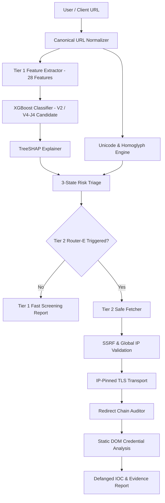

# Web Shield

> **Explainable Two-Stage Phishing Detection and Forensic Triage Platform**

[](https://www.python.org/)
[](https://flask.palletsprojects.com/)
[](https://xgboost.readthedocs.io/)
[](https://shap.readthedocs.io/)
[]()
[](LICENSE)

---

## Overview

**Web Shield** is an explainable, two-stage phishing detection and forensic triage platform designed for modern security operations and automated threat analysis. Unlike traditional black-box security tools that return arbitrary risk scores, Web Shield combines rapid machine-learning screening with security-hardened forensic analysis to deliver transparent, actionable threat intelligence.

- **Tier 1 (Rapid ML Screening)**: Performs lightweight, real-time feature extraction across URL structure, hostname entropy, brand token mismatch, TLS state, and domain age, passing canonical features to an XGBoost model. Every prediction is paired with **TreeSHAP attribution**, surfacing exact feature contributions and neutral semantic interpretations.
- **Tier 2 (Forensic Deep Analysis)**: Triggers an isolated, SSRF-protected network transport to inspect HTTP response headers, trace redirect chains step-by-step, conduct static DOM credential sink audits, and export defanged Indicators of Compromise (IOCs).

Web Shield provides a 3-state risk verdict (`SAFE`, `SUSPICIOUS`, `CRITICAL`), SHAP risk explanations, Unicode/Punycode homoglyph analysis, redirect evidence, credential form audits, defanged IOC outputs, and defensive deep-analysis reports.

---

## Production & Candidate System Status

- **Active Production Default**: **Model V2** (`models/xgb_model_v2.pkl`, 11 features) is configured as the active production predictor in `src/predictor.py` and `app.py`.
- **Shadow Candidate Tier 1**: **V4-J4** (`models/v4_variants/v4_j4/xgb_model_v4_j4.pkl`, 28 features) is fully integrated as the candidate Tier-1 model paired with **Router-E**.

---

## Architecture



### Router-E Triage Specification
Router-E determines whether Tier 2 static forensic analysis is required based on structural URL properties:
1. **`AMBIGUOUS_BAND`**: $0.40 \le P_{\text{ML}} \le 0.60$
2. **`AUTH_WEAK_CLASS`**: $0.25 \le P_{\text{ML}} < 0.35$ with authentication context keywords (`login`, `auth`, `sso`, etc.)
3. **`SHARED_HOSTING`**: Shared hosting platform (`workers.dev`, `netlify.app`, etc.) with auth context or $P_{\text{ML}} \ge 0.20$
4. **`BRAND_MISMATCH`**: Brand token mismatch with auth context or $P_{\text{ML}} \ge 0.15$
5. **`IP_HOST`**: Hostname is a raw IP address

---

## Benchmark Metrics & Reconciliation Table

Below is the reconciled summary of evaluation metrics across benchmarks and router configurations:

| Evaluation Benchmark | Model / Router | Phishing Recall | FPR | Total Routing | Non-IP Routing | Benchmark Context & Description |
| :--- | :--- | :--- | :--- | :--- | :--- | :--- |
| **Final Independent Auth (426)** | V4-J4 + Router-E | **100.00%** | **0.00%** | **20.66%** | **20.66%** | Clean, 173-domain balanced authentication holdout (250 Phish, 176 Legit Auth). Zero leakage. |
| **Final Independent Auth (426)** | V4-J4 + Router-D | **100.00%** | **0.00%** | **51.88%** | **51.88%** | Historical Router-D baseline on independent auth benchmark. |
| **Primary Holdout (452)** | V4-J4 + Router-E | **95.20%** | **4.95%** | **60.40%** | **8.63%** | 452-sample primary holdout (`dataset_blind_holdout.csv`). Contains 234 IP-host threat URLs. |
| **Primary Holdout (452)** | V4-J4 + Router-D | **97.20%** | **5.94%** | **61.28%** | **12.39%** | Historical Router-D baseline on primary holdout. Recovered 4 FNs via Tier 2. |
| **Primary Holdout (452)** | V4-J4 Baseline | **95.60%** | **5.94%** | N/A | N/A | Standalone Tier 1 V4-J4 model without Tier 2 routing. |

*IP-Host Routing Note*: Router-E routes 60.40% of the primary holdout in total, but only 8.63% when IP-host cases are excluded. The primary holdout contains an unusually large concentration of IP-host phishing samples (234 / 452 URLs).

*Release Claim Note*: V4-J4 achieved 100% credential-phishing recall and 0% legitimate-auth FPR on the frozen 426-sample independent authentication benchmark. All results are benchmark-specific and do not represent claims of universal real-world accuracy.

---

## System Capabilities & Limitations

### Static Forensics Capabilities (Tier 2 Phase 1)
- Static HTML form parsing and input field analysis.
- Password input field detection.
- Registered-domain form destination relationship auditing (`SAME_ORIGIN`, `SAME_REGISTERED_DOMAIN`, `EXTERNAL_REGISTERED_DOMAIN`).
- Cross-origin external credential POST detection.
- HTTPS-to-HTTP unencrypted credential submission (downgrade attack) detection.
- Redirect chain tracing and step-by-step SSRF revalidation.

### Limitations (Phase 1 Scope)
Current Tier 2 static analysis does **NOT** guarantee detection of:
- JavaScript-only rendered credential forms (e.g. single-page apps rendering forms via AJAX).
- Shadow-DOM or iframe-encapsulated forms.
- Executable binary malware, script payloads (`.exe`, `.ps1`, `.js`, `.dll`).
- Archive files (`.zip`, `.rar`, `.7z`) or image steganography.

### Future Roadmap
- **Phase 2 (Isolated Browser Renderer)**: Headless browser environment to execute client-side JavaScript and render dynamic DOMs for single-page application (SPA) credential flows.
- **Phase 3 (Payload Analysis Service)**: Dedicated sandbox service for deep inspection of executable binaries, scripts, and document archives.

---

## Installation & Setup

### Prerequisites
- Python 3.10+
- Git

### Installation Steps

1. **Clone the Repository**:
   ```bash
   git clone https://github.com/Chinnampavansai2008/WEB-SHIELD-PHISHING-DETECTION.git
   cd WEB-SHIELD-PHISHING-DETECTION
   ```

2. **Create a Virtual Environment**:
   ```bash
   python -m venv venv
   # On Windows:
   venv\Scripts\activate
   # On Linux/macOS:
   source venv/bin/activate
   ```

3. **Install Dependencies**:
   ```bash
   pip install -r requirements.txt
   ```

4. **Launch the Server**:
   ```bash
   python app.py
   ```
   Access the Web Interface at `http://127.0.0.1:5000/`.

---

## API Usage Examples

### 1. Rapid Tier 1 Analysis (`POST /api/v1/analyze`)
```bash
curl -X POST http://127.0.0.1:5000/api/v1/analyze \
  -H "Content-Type: application/json" \
  -d '{"url": "https://sso.harvard.edu/cas/login"}'
```

### 2. Forensic Deep Analysis (`POST /api/v1/deep-analyze`)
```bash
curl -X POST http://127.0.0.1:5000/api/v1/deep-analyze \
  -H "Content-Type: application/json" \
  -d '{"url": "http://microsoft-online-secure-auth-100.com/login.php"}'
```

---

## Rollback & Configuration

To toggle active model versions or router configurations:
- **Environment Variable Override**:
  ```bash
  export WEBSHIELD_MODEL_VERSION=v2 # Reverts to Model V2 production baseline
  ```
- **Router Configuration Override**:
  Pass `router_version='D'` or `router_version='E'` to `route_for_tier2()`.

---

## Running Tests

Execute the full automated test suite (114 tests):
```bash
pytest tests/
```
