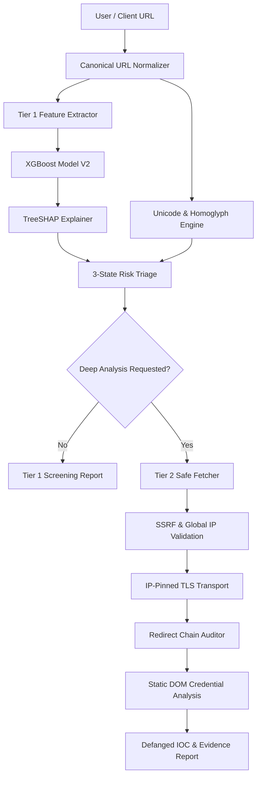

# Web Shield

> **Explainable Two-Stage Phishing Detection and Forensic Triage Platform**

[](https://www.python.org/)
[](https://flask.palletsprojects.com/)
[](https://xgboost.readthedocs.io/)
[](https://shap.readthedocs.io/)
[]()
[](LICENSE)

---

## Overview

**Web Shield** is an explainable, two-stage phishing detection and forensic triage platform designed for modern security operations and automated threat analysis. Unlike traditional black-box security tools that return arbitrary risk scores, Web Shield combines rapid machine-learning screening with security-hardened forensic analysis to deliver transparent, actionable threat intelligence.

- **Tier 1 (Rapid ML Screening)**: Performs lightweight, real-time feature extraction across URL structure, hostname entropy, TLS state, and domain age, passing 11 canonical features to an XGBoost model. Every prediction is paired with **TreeSHAP attribution**, surfacing exact feature contributions and neutral semantic interpretations.
- **Tier 2 (Forensic Deep Analysis)**: Triggers an isolated, SSRF-protected network transport to inspect HTTP response headers, trace redirect chains step-by-step, conduct static DOM credential sink audits, and export defanged Indicators of Compromise (IOCs).

Web Shield doesn't just output a phishing probability—it provides a 3-state risk verdict (`SAFE`, `SUSPICIOUS`, `CRITICAL`), SHAP risk explanations, Unicode/Punycode homoglyph analysis, redirect evidence, credential form audits, defanged IOC outputs, and defensive deep-analysis reports.

---

## Architecture



---

## Key Features

### Tier 1: Explainable ML Screening
- **Rapid Feature Extraction**: Extracts 11 structural features in ~1.5ms without requiring external browser rendering.
- **TreeSHAP Attribution**: Computes unscaled, exact SHAP contribution values for top risk factors.
- **Semantic Explanation Layer**: Separates mathematical SHAP direction (`toward_phishing` vs `toward_legitimate`) from neutral feature descriptions to prevent misleading claims on standard URLs.
- **Unicode & Homoglyph Detection**: Detects Punycode (`xn--`), mixed-script domains, and confusable character sets without automatically flagging legitimate internationalized domain names as phishing.
- **Domain Age Status Engine**: Classifies domain age into `UNKNOWN` (-1), `NEW` ($\le 6$ months), or `ESTABLISHED`, ensuring WHOIS lookup failures are safely marked `UNKNOWN` rather than misclassified as new domains.
- **Versioned Model Architecture**: Supports versioned model loading (`ModelPredictor`) with instant environment-based rollback (`WEBSHIELD_MODEL_VERSION=v2`).

### Tier 2: Security-Hardened Forensic Triage
- **SSRF & IP Validation**: Enforces strict pre-connection checks blocking loopback (`127.0.0.1`, `::1`), private RFC1918 subnets (`10.0.0.0/8`, `172.16.0.0/12`, `192.168.0.0/16`), link-local (`169.254.169.254`), CGNAT, and NAT64/mapped IPv6 addresses.
- **DNS Pinning & SNI Preservation**: Custom socket adapter (`PinnedIPAdapter`) pins TCP connections to validated IP addresses while retaining the original target hostname for TLS Server Name Indication (SNI) and certificate validation.
- **Manual Redirect Chain Tracing**: Intercepts and re-validates every HTTP redirect hop against SSRF rules before following.
- **Static DOM Credential Sink Audit**: Scans HTML forms for password fields, email harvesting, external form actions, suspicious credential sinks, and OAuth/payment provider contexts.
- **Failed-Fetch Safety Semantics**: Guarantees network/DNS/TLS lookup failures never produce false `CLEAN` verdicts or HTTP `0`. Failed fetches return `fetch_succeeded=False`, `scan_status=failed`, `credential_analysis=NOT_EVALUATED`, and `sink_risk=UNKNOWN`.
- **Defanged IOC Export**: Formats URLs into defanged text (`hxxps[://]...[.]...`) and exports structured JSON IOC reports protected against XSS injection.

---

## Installation & Setup

### Prerequisites
- Python 3.10+
- Git

### Installation Steps

1. **Clone the Repository**:
   ```bash
   git clone https://github.com/Chinnampavansai2008/WEB-SHIELD-PHISHING-DETECTION.git
   cd WEB-SHIELD-PHISHING-DETECTION
   ```

2. **Create a Virtual Environment**:
   ```bash
   python -m venv venv
   # On Windows:
   venv\Scripts\activate
   # On Linux/macOS:
   source venv/bin/activate
   ```

3. **Install Dependencies**:
   ```bash
   pip install -r requirements.txt
   ```

4. **Launch the Server**:
   ```bash
   python app.py
   ```
   Access the Cyber-Command Web Interface at `http://127.0.0.1:5000/`.

---

## Usage Guide

### 1. Web Interface
Navigate to `http://127.0.0.1:5000/` to use the interactive dashboard. Submit any URL for real-time Tier 1 screening, view top SHAP risk factors, inspect Punycode/homoglyph alerts, and trigger Tier 2 Forensic Deep Analysis.

### 2. REST API Endpoints

#### `POST /predict`
Legacy form endpoint returning binary classification and probability.

#### `POST /api/v1/analyze` (Tier 1 Screening API)
Returns structural features, model metadata, risk classification, and SHAP explanations.

**Request Payload**:
```json
{
  "url": "https://github.com/Chinnampavansai2008/WEB-SHIELD-PHISHING-DETECTION"
}
```

**Response Payload**:
```json
{
  "success": true,
  "data": {
    "url": "https://github.com/Chinnampavansai2008/WEB-SHIELD-PHISHING-DETECTION",
    "prediction": true,
    "phishing_probability": 0.0678,
    "risk_level": "safe",
    "model_version": "v2",
    "model_feature_count": 11,
    "domain_age_status": "UNKNOWN",
    "top_risk_factors": [
      {
        "feature": "url_length",
        "label": "URL Character Count",
        "observed_value": 68,
        "shap_value": -0.4067,
        "direction": "toward_legitimate",
        "semantic_interpretation": "Standard structural path length"
      }
    ]
  }
}
```

#### `POST /api/v1/deep-analyze` (Tier 2 Forensic API)
Executes Tier 1 ML screening followed by Tier 2 SSRF-protected network fetch, redirect tracing, static DOM credential audit, and IOC generation.

---

## Model Performance & Honest Evaluation

Web Shield's active production default is **Model V2** (`models/v2/xgb_model_v2.pkl`). Model performance has been rigorously benchmarked across three frozen evaluation partitions:

### Authoritative Benchmark Results

| Evaluation Partition | Dataset / Description | Samples | Accuracy | Precision | Recall | F1-Score | ROC-AUC | FPR |
| :--- | :--- | :---: | :---: | :---: | :---: | :---: | :---: | :---: |
| **SET A: Legacy V2 Grouped** | `LEGACY_V2_GROUPED_TEST` (Registered-domain split) | 245 | **95.92%** | **94.32%** | **94.32%** | **94.32%** | **99.02%** | **3.18%** |
| **SET B: V3 Grouped** | `V3_GROUPED_TEST` (Length-balanced domain split) | 444 | **66.67%** | 37.93% | **77.78%** | 50.99% | 84.95% | 36.52% |
| **SET C: Hard Holdout** | `HARD_HOLDOUT` (Independent hard test URLs) | 198 | **80.30%** | **80.00%** | **77.42%** | **78.69%** | 88.44% | 17.14% |

> [!IMPORTANT]
> **Honest ML Performance Statement**: Model V2 achieved 95.92% accuracy on its legacy registered-domain grouped benchmark, while harder generalization evaluations produced lower results. Model V2 exhibits URL-length sensitivity on complex non-bare URLs ($url\_length > 30$) such as Wikipedia articles, GitHub repositories, and checkout pages. Candidate models (V3/V3.1) were trained and evaluated to explore this tradeoff; however, Model V2 remains the production baseline to preserve primary benchmark recall.

---

## Security & Forensic Hardening

Web Shield enforces strict defensive engineering across network transport and data handling:

1. **Air-Tighter SSRF Protection**: Validates all IP addresses resolved by DNS against IPv4/IPv6 private ranges before opening sockets.
2. **Pinned IP Transport**: Prevents DNS rebinding attacks by forcing TCP socket connections directly to pre-validated IP addresses.
3. **SNI & TLS Verification**: Retains original SNI hostnames for TLS handshakes and enforces valid certificate chains.
4. **Safe Redirect Handling**: Disables automatic HTTP library redirects, re-validating each location header destination before following.
5. **Failed-Fetch Resilience**: Network failures set `fetch_succeeded=False`, `scan_status=failed`, `credential_analysis=NOT_EVALUATED`, and `sink_risk=UNKNOWN`. Failed fetches NEVER fabricate HTTP status `200` or `0`, and NEVER display `CLEAN`.
6. **Defanged Output**: Suspicious URLs are automatically defanged (`hxxps[://]domain[.]com`) in reports to prevent accidental clicks.

---

## Project Structure

```text
WEB-SHIELD-PHISHING-DETECTION/
├── app.py                      # Main Flask application & API routes
├── requirements.txt            # Dependency declarations
├── README.md                   # Project documentation
├── data/                       # Datasets & evaluation splits
│   ├── dataset_v2.csv
│   ├── dataset_v3.csv
│   └── dataset_v3_1.csv
├── models/                     # Frozen XGBoost model artifacts
│   ├── v2/                     # Active Production Default (V2)
│   ├── v3/                     # Experimental Model V3
│   └── v3_1/                   # Experimental Model V3.1
├── src/                        # Core application modules
│   ├── predictor.py            # Unified ModelPredictor abstraction
│   ├── feature_extraction.py   # 11-feature canonical extractor
│   ├── explainability.py       # TreeSHAP & neutral label mapper
│   ├── homoglyph.py            # Unicode & Punycode detector
│   ├── safe_fetcher.py         # SSRF-protected DNS-pinned transport
│   ├── deep_analysis.py        # Tier 2 forensic analyzer
│   ├── credential_analysis.py  # Static DOM credential sink auditor
│   └── ioc.py                  # Defanged IOC generator
├── templates/                  # Jinja2 HTML templates
│   └── index.html              # Cyber-Command Web Dashboard
└── tests/                      # Automated test suite (73/73 PASS)
    ├── test_e2e_routes.py      # Route integration tests
    ├── test_fetch_failures.py  # Network failure semantics tests
    ├── test_phase3_api.py      # API contract validation tests
    ├── test_safe_fetcher.py    # SSRF & DNS pinning security tests
    ├── test_domain_age.py      # Domain age UNKNOWN semantics tests
    ├── test_explainability.py  # TreeSHAP vector alignment tests
    └── test_v2_integration.py # Model V2 integration tests
```

---

## Running Automated Tests

Run the complete test suite (73 passing tests):

```bash
python -m unittest discover tests
```

Expected Output:
```text
.........................................................................
----------------------------------------------------------------------
Ran 73 tests in 16.482s

OK
```

---

## License

This project is open-source and available under the [MIT License](LICENSE).
