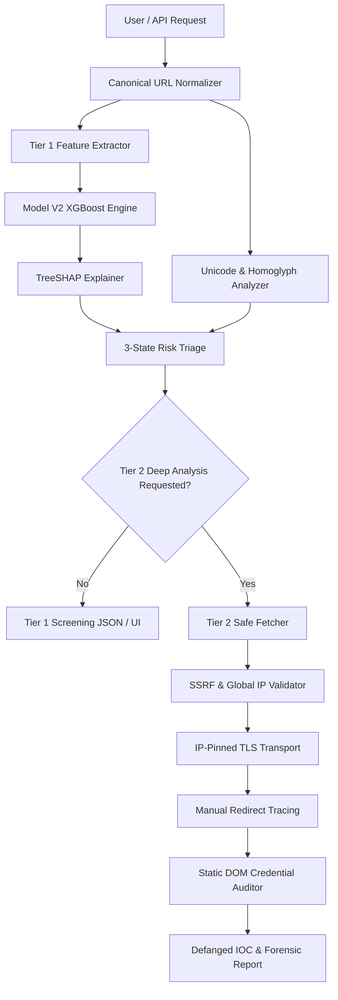

# Web Shield — Architecture Specification

## Overview

Web Shield implements a **two-stage hybrid architecture** combining fast ML-based triage (Tier 1) with isolated, security-hardened forensic analysis (Tier 2).

---

## Component Breakdown

### 1. Canonical URL Normalizer (`src/url_normalizer.py`)
- Standardizes scheme, hostname casing, path, and query strings.
- Validates scheme against allowed protocols (`http`, `https`).
- Strips userinfo/credentials in URLs to prevent authentication confusion attacks.

### 2. Tier 1 Screening Engine (`src/feature_extraction.py`, `src/predictor.py`)
- **Feature Extraction**: Extracts 11 canonical structural and network features in ~1.5ms.
- **Model Predictor (`src/predictor.py`)**: Manages model loading, unscaled feature vector ordering, and XGBoost inference using Model V2 (`models/v2/xgb_model_v2.pkl`).
- **TreeSHAP Explainability (`src/explainability.py`)**: Computes exact TreeSHAP attributions using unscaled feature inputs, formatting top risk signals with neutral semantic descriptions.
- **Unicode & Homoglyph Detection (`src/homoglyph.py`)**: Identifies Punycode (`xn--`), mixed-script domains, and confusable character sets.

### 3. Tier 2 Safe Fetcher (`src/safe_fetcher.py`)
- **SSRF Prevention**: Resolves domain IP addresses via DNS and validates every IP against private, loopback, link-local, CGNAT, and NAT64/mapped IPv6 subnets.
- **IP Pinning**: `PinnedIPAdapter` binds TCP socket destination directly to validated IP addresses.
- **TLS & SNI Validation**: Retains original SNI hostnames for TLS handshake and enforces certificate verification (`CERT_REQUIRED`).
- **Step-by-Step Redirect Tracing**: Disables HTTP library auto-redirects; manually intercepts and validates every `Location` header destination before following.

### 4. Static DOM Credential Auditor (`src/credential_analysis.py`)
- Scans HTML DOM trees for `<form>` elements, `<input type="password">`, email harvesting inputs, external form action targets, and credential sinks.
- Weighting logic incorporates OAuth/payment context indicators (`google.com`, `paypal.com`, `stripe.com`) to evaluate context risk.

### 5. IOC & Defanging Generator (`src/ioc.py`, `src/defang.py`)
- Formats malicious indicators into defanged representations (`hxxps[://]domain[.]com`).
- Exports structured JSON IOC reports safe from stored/reflected XSS.
